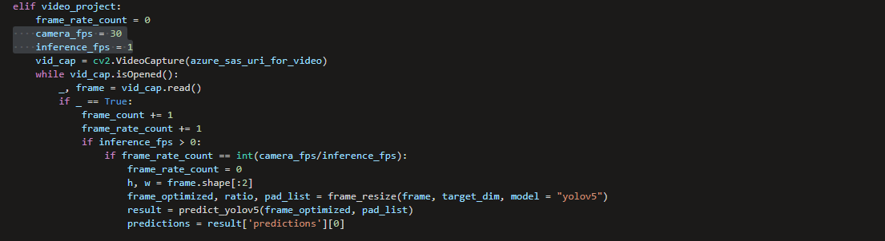

# Region-of-Interest-Cropping-for-Image-Classification
Instructions and Code sample to crop detected objects for further image classification. 

When performing image analysis, it may prove useful to pursue more of a serial ensemble model approach, where the first model detected an object of interest, and a secondary model(s) then analyzes the object(s) into your desired classes.  This can be very useful if the image has multiple objects being detected with multiple classes for each object. 

Another use of this approach would be identifying the object and expanding the detection bounding box before cropping to gain additional context to aid in classification.

In order to implement this approach, however, you would need to first train your object detection model.  For the purposes of this repo, we'll utilize Azure ML AutoML for Images with the YOLOv5 algorithm along with the Azure ML SDK v2 (in the ROI_crop_for_YOLOv5 notebook).  

Once you've labeled your images and trained the object detection model, you'll want to make a note of a few of the items you'll need to run the notebook:

    1. Your AutoML Job Name
    2. Your Azure Storage connection string
    3. Your container name where you're storing your raw images
    4. Your prefix (if used) for your virtual directory within the container

You'll want to download this repository to your local machine, and then upload the folder into your Azure Machine Learning workspace.

In code block 3 (shown below) there are boolean values for the project type - image or video - which you'll want to make the appropriate selection for your use case.  The minimum_crop_size variable allows you to set a threshold for the minimum size of object you want to a capture for your classification dataset.

If you're going to utilize video, there are two other variables in the last code block you'll want to review also at lines 90 and 91.  For video, you won't necessarily want to capture every frame, so you can set your frames-per-second rate for your video on line 90, and then your inferences-per-second rate on line 91.  The code will calculate when to perform the inference.

When your job has completed, you'll have a new datasets for each object type in your Azure Storage which you can now label and train.

In deployment mode, you can utilize this same ensemble code, cropping the image before calling the classification model inference.

Hope you found this useful to your vision analytics project!